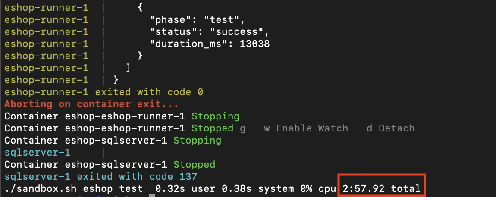
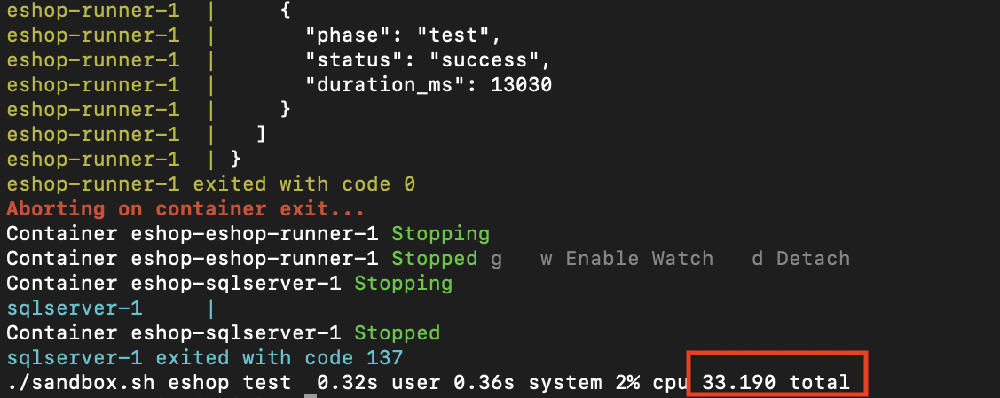
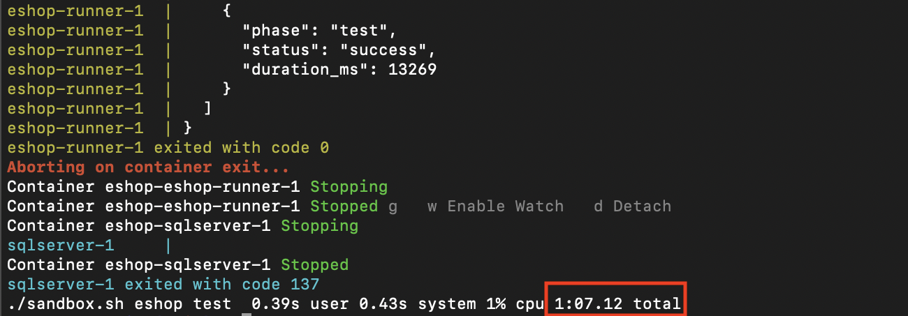
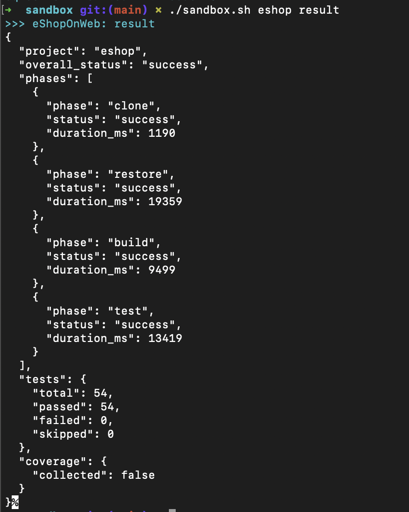
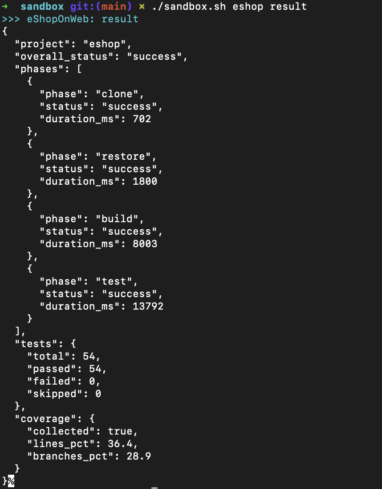
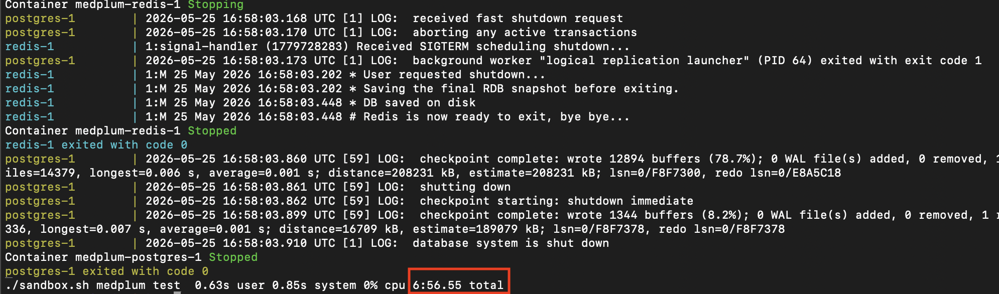
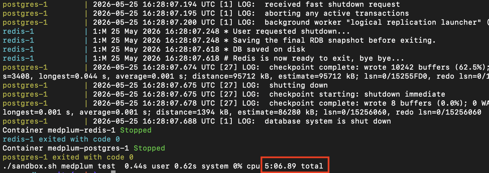
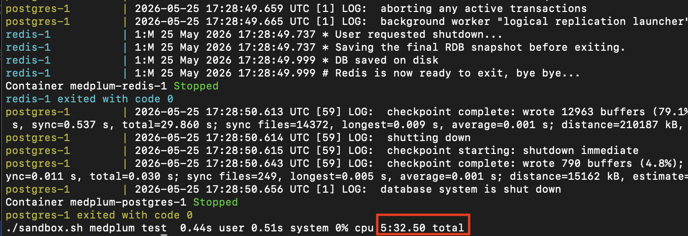
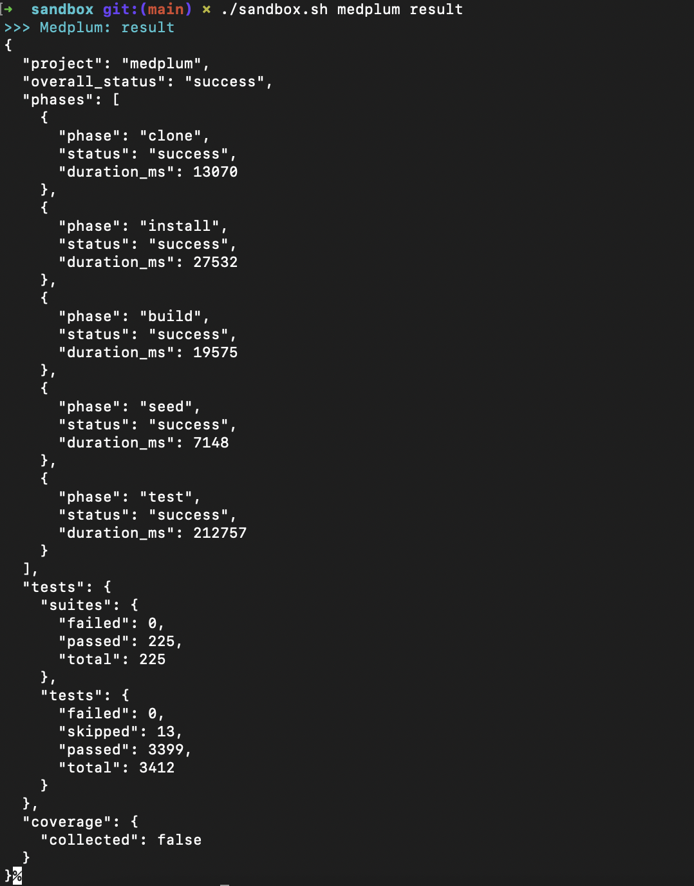
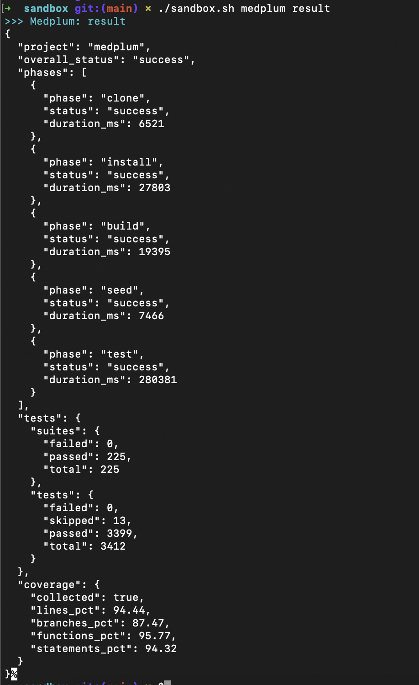

# AI Agent Sandbox

A Docker-based execution environment for AI coding agents. The agent clones a repository, makes changes to the code, then mounts the workspace into this sandbox to build, test, and validate output before a pull request is opened.

Demo URL: https://drive.google.com/file/d/1r_N5TNf8dOTU5B7b_zwumTRfPvSclAqm/view?usp=drive_link

---

## Proof It Works and Performance

Both projects verified on first run (clean Docker environment, no pre-cached images):

### eShopOnWeb — `./sandbox.sh eshop test`

#### Cold start on a fresh host — no pre-built image, no cached volumes



Completed in 2m58s

#### Rerun with warm cache



Completed in 33s

#### Reset backend data with `./sandbox.sh eshop reset` and rerun



Completed in 1m07s

#### Sample test output

Without coverage:



With coverage:



### Medplum — `./sandbox.sh medplum test`

#### Cold start on a fresh host — no pre-built image, no cached volumes



Completed in 6m57s

#### Rerun with warm cache



Completed in 5m07s

#### Reset backend data with `./sandbox.sh medplum reset` and rerun



Completed in 5m33s

#### Sample test output

Without coverage:



With coverage:



---

## Quick Start

```bash
# Clone from GitHub, build, seed DB and infrastructure, run all tests
./sandbox.sh <eshop|medplum> test

# Start the application only (app + SQL Server, auto-migrates), no tests
./sandbox.sh <eshop|medplum> up

# Read the last structured result JSON
./sandbox.sh <eshop|medplum> result

# Clean app state for a fresh run (preserves dep cache)
./sandbox.sh <eshop|medplum> reset && ./sandbox.sh <eshop|medplum> test

# Collect coverage (off by default — roughly doubles test time)
COLLECT_COVERAGE=1 ./sandbox.sh <eshop|medplum> test

# Agent mode: mount your own workspace
WORKSPACE_PATH=/path/to/repo USE_MOUNTED_WORKSPACE=1 \
  ./sandbox.sh <eshop|medplum> test
```

---

## Workflow A: Agent Modifies Code and Tests Its Own Changes

The primary workflow: an agent is assigned a task, writes code changes to a cloned workspace, and uses this sandbox to verify those changes compile and pass tests before opening a PR.

```
1. Harness assigns task: "Fix the auth bug in eShopOnWeb PR #42"
2. Harness clones repo at PR commit into /workspaces/agent-{id}/
3. Agent reads code, writes fix
4. Agent calls sandbox_test("eshop", workspacePath="/workspaces/agent-{id}/")
   → Sandbox mounts workspace, runs dotnet build + test against agent's source
5. Agent receives result JSON
   → overall_status="failure"? Fix and retry (step 3)
   → overall_status="success"? Open PR
6. Harness cleans up workspace
```

The sandbox uses a **toolchain image** — it contains only the SDK/Node/Git toolchain, with no pre-compiled source. The agent's modified workspace is bind-mounted read-only at `/workspace-host`; the entrypoint copies it in and runs a full build + test cycle. This ensures the test run exercises the agent's actual changes, not stale compiled artifacts.

---

## Architecture

### Decision 1: Two separate docker-compose stacks (not one)

```
sandbox/
├── eshop/          docker-compose.yml  →  SQL Server 2022 + .NET 10 runner
└── medplum/        docker-compose.yml  →  PostgreSQL 16 + Redis 7 + Node 24 runner
```

**Why not one shared composition?**

The projects have fundamentally different infrastructure requirements:

| Concern       | eShopOnWeb            | Medplum                    |
|---------------|-----------------------|----------------------------|
| Database      | SQL Server 2022       | PostgreSQL 16              |
| Cache         | none                  | Redis 7                    |
| Runtime       | .NET 10 / C#          | Node 24 / TypeScript       |
| Build system  | `dotnet CLI`          | `npm` / Turborepo          |
| Memory floor  | ~2 GB (SQL Server)    | ~1.5 GB (Postgres + server)|

Sharing a single composition would mean:
- Running all four database services simultaneously (~3.5 GB RAM baseline)
- Complex volume management with no cross-contamination guarantee
- A failure in one project's DB taking down the other

With separate stacks:
- Each stack is independently startable, resettable, and debuggable
- Resource usage is additive only when both are running (which an agent rarely needs)
- `./sandbox.sh all test` runs them sequentially to control peak memory

**What an AI agent harness prefers:** Separate isolated environments. An agent
working on a ticket for eShopOnWeb has no reason to spin up Medplum's
PostgreSQL. The harness calls `./sandbox.sh eshop test` and gets a binary
pass/fail plus structured JSON. Simple.

---

### Decision 2: Toolchain image + workspace mount

The sandbox runner uses a **toolchain image** — an image containing only the SDK/Node/Git toolchain with no pre-compiled source. The agent's modified workspace is bind-mounted read-only at `/workspace-host`; the entrypoint copies it in and runs a full compile + test cycle:

```bash
WORKSPACE_PATH=/path/to/agent/workspace USE_MOUNTED_WORKSPACE=1 \
  ./sandbox.sh eshop test
```

A pre-compiled image cannot be used here: it would contain the *old* compiled artifacts, not the agent's changes. The test run must start from source.

**Dockerfile dep layer caching:**
The Dockerfile separates package installation into a dedicated `deps` stage. Docker only re-runs this stage when lock files (`package-lock.json`, `*.csproj`) change — far less frequently than source changes. On a cache hit, `npm ci` / `dotnet restore` complete in seconds.

**Named dep-cache volumes:**
`medplum-npm-cache` and `eshop-nuget-cache` persist ~700 MB of downloaded packages across `reset`, so the registry is not hit again when lock files are unchanged. The two mechanisms complement each other: Docker layer cache speeds up `docker build`; named volumes speed up the entrypoint's install step in toolchain mode.

**Turborepo `--filter`:**
The Medplum build uses `--filter=@medplum/server` to build only the server and its workspace dependencies, skipping docs, examples, and all other packages in the monorepo.

---

### Decision 3: Two-tier volume strategy (dep cache vs. app data)

| Volume                  | Type       | Survives `reset`? | Purpose                     |
|-------------------------|------------|-------------------|-----------------------------|
| `eshop-nuget-cache`     | Named      | Yes               | NuGet package cache         |
| `medplum-npm-cache`     | Named      | Yes               | npm registry cache          |
| `eshop-sqlserver-data`  | Named      | **No**            | SQL Server database files   |
| `medplum-postgres-data` | Named      | **No**            | PostgreSQL data directory   |
| `medplum-redis-data`    | Named      | **No**            | Redis AOF/RDB snapshots     |
| `sandbox-output`        | Named      | **No**            | Structured result JSON + phase logs |

**Reset = clean app state, keep dependency cache.**

Dep cache volumes provide fast iteration in toolchain mode:
- `dotnet restore` skips the network entirely (packages already in `/root/.nuget`)
- `npm ci --prefer-offline` resolves from `/root/.npm` without hitting the registry

Without this, each run would re-download ~200 MB of NuGet packages and ~500 MB
of npm packages. With a warm cache those phases drop from minutes to seconds.

`./sandbox.sh eshop reset` destroys the SQL Server and sandbox-output volumes.
The next run gets a pristine database and clean result output, but retains the
NuGet cache for the next run.

---

### Decision 4: Database initialization strategy (no manual migration steps)

**eShopOnWeb:** EF Core is configured to call `context.Database.Migrate()` at
startup inside `SeedDatabaseAsync()`. The app also seeds catalog and identity
data on first boot. The sandbox exposes this via `SANDBOX_MODE=up`.

No manual `dotnet ef database update` step is required — the application is
self-migrating. This is correct behaviour for a sandbox: no interactive steps.

The retry logic in `CatalogContextSeed` (10 attempts, 100ms delay) handles the
SQL Server startup race condition cleanly.

**Medplum:** The server calls `initApp()` which runs all pending schema and data
migrations on startup. The `test:seed` script seeds the test database with FHIR
resources and an admin account before the test suite runs.

The PostgreSQL init script (`initdb/01-test-db.sql`) creates `medplum_test`
during container first-boot so both the main and test databases exist when the
runner container starts.

---

### Decision 5: eShopOnWeb SDK version — .NET 10

The repo contains a stale conflict: `global.json` requires `.NET SDK 10.0.0`
and all `.csproj` files target `net10.0`, but the project's own `src/Web/Dockerfile`
and `src/PublicApi/Dockerfile` still reference `sdk:9.0` (they weren't updated
when the project upgraded to .NET 10).

The sandbox Dockerfile uses `mcr.microsoft.com/dotnet/sdk:10.0` to match what
the code actually requires. Using 9.0 fails immediately with `NETSDK1045` because
the SDK cannot compile code targeting a higher framework version.

This was identified during the first live test run — the initial assumption was
that patching `global.json` would suffice, but `.csproj` target frameworks are
separate from the SDK constraint and also require .NET 10.

---

### Decision 6: Structured output capture

Every phase (clone, restore, build, test) is timed and written to a JSONL file.
On completion, `result.json` is assembled from phases, parsed test counts, and
optional coverage:

```json
{
  "project": "eshop",
  "overall_status": "success",
  "phases": [
    { "phase": "clone",   "status": "success", "duration_ms": 736   },
    { "phase": "restore", "status": "success", "duration_ms": 26081 },
    { "phase": "build",   "status": "success", "duration_ms": 9501  },
    { "phase": "test",    "status": "success", "duration_ms": 13200 }
  ],
  "tests": {
    "total": 54, "passed": 54, "failed": 0, "skipped": 0
  },
  "coverage": { "collected": false }
}
```

With `COLLECT_COVERAGE=1`, the `coverage` field is populated:

```json
"coverage": {
  "collected":    true,
  "lines_pct":    85.2,
  "branches_pct": 72.1
}
```

Medplum additionally reports `functions_pct` and `statements_pct` (Istanbul
reports all four; .NET Coverlet reports lines + branches only).

```bash
# Fast agent iteration — no coverage
./sandbox.sh eshop test

# CI/PR reporting — full coverage
COLLECT_COVERAGE=1 ./sandbox.sh eshop test
```

JSONL lets each phase append atomically without locking. If the container crashes mid-run, the phases
already emitted are still readable. The final step merges phases + test
summary + coverage into one document.

**Files in `sandbox-output`:**

| File | Content |
|------|---------|
| `result.json` | Final aggregated result (phases + tests + coverage) |
| `phases.jsonl` | One JSON object per phase, written as each completes |
| `test-summary.json` | Parsed test counts (intermediate, merged into result) |
| `coverage-summary.json` | Parsed coverage percentages (intermediate, merged into result) |
| `{phase}.log` | Raw stdout/stderr for each phase |
| `test-results/results.trx` | VSTest XML (eShopOnWeb, raw dotnet test output) |
| `coverage/coverage-summary.json` | Raw Istanbul JSON (Medplum, before parsing) |

---

### Decision 7: Non-interactive execution

Points where the projects make interactive assumptions and how we address them:

| Project      | Interactive assumption              | Sandbox fix                            |
|--------------|-------------------------------------|----------------------------------------|
| eShopOnWeb   | SQL Server licence acceptance       | `ACCEPT_EULA=Y` env var               |
| eShopOnWeb   | Development HTTPS certificate       | `ASPNETCORE_ENVIRONMENT=Docker` disables HTTPS redirect |
| eShopOnWeb   | User Secrets mount                  | Removed from compose (not needed for tests) |
| Medplum      | OTEL collector presence             | `OTEL_SDK_DISABLED=true`              |
| Medplum      | Interactive npm prompts             | `npm ci` is always non-interactive    |
| Both         | TTY for coloured output             | Entrypoints don't require a TTY       |

---

### Decision 8: Resource limits

| Service             | Memory limit | Reason                                    |
|---------------------|-------------|-------------------------------------------|
| SQL Server          | 2 GB        | MSSQL minimum; no limit causes OOM on dev machines |
| Postgres            | (none)      | PG 16 is much lighter; defaults are fine  |
| Node / .NET runners | (none)      | Variable by workspace; left to OS         |

SQL Server without a memory cap will attempt to claim all available RAM. The
`2g` limit in `eshop/docker-compose.yml` prevents this while still satisfying
MSSQL's 2 GB minimum.

---

### Decision 9: Security and isolation

The sandbox executes arbitrary code generated by AI agents. Isolation layers:

1. **Container boundary** — processes inside cannot affect the host filesystem
   except via explicit volume mounts. The workspace mount is `:ro` (read-only)
   so the agent's code cannot overwrite the source it was given.

2. **Network isolation** — each stack runs on its own bridge network
   (`eshop-net`, `medplum-net`). Containers in one stack cannot reach
   containers in the other.

3. **No host-network mode** — containers use bridge networking, not
   `--network=host`. SQL Server and PostgreSQL are not exposed to the wider
   network (no published ports in production mode; remove the `ports:` entries
   from the compose file for tighter isolation).

4. **No privileged mode, non-root runtime users** — the runtime deploy images
   run as explicit non-root users (`USER medplum` in the Medplum Alpine image,
   `USER $APP_UID` in the eShopOnWeb chiseled image). SQL Server requires root
   inside its own container (Microsoft requirement) but this is contained within
   that container and does not affect the application containers.

5. **What this doesn't protect against:** Malicious code that exhausts disk or
   CPU, or exploits a kernel vulnerability. For a hardened production sandbox
   you'd add `--security-opt seccomp=...`, cgroup CPU limits, and a read-only
   root filesystem with explicit tmpfs mounts.

---

## Build & Startup Performance

A sandbox that takes 15 minutes to spin up is useless for iterative agent work.
The strategy is layered: eliminate redundant work at each stage so the common
case hits the fastest path.

### Where the time actually goes

| Phase | eShopOnWeb | Medplum | Notes |
|-------|-----------|---------|-------|
| Clone | ~1 s | ~6 s | `--depth=1` |
| Dep install | ~26 s (restore) | ~39 s (npm ci) | Layer cache hit → seconds |
| Build | ~10 s | ~25 s | |
| DB seed | — | ~18 s | Runs every test invocation |
| Test execution | ~13 s | ~537 s | Cannot be skipped |
| Infra startup | ~30 s (SQL Server) | ~20 s (PG + Redis) | Parallel healthcheck wait |

**eShopOnWeb's bottleneck is infrastructure startup** (SQL Server is slow to
initialise). Tests themselves take only 13 seconds.

**Medplum's bottleneck is test execution** (3 412 tests against a real database
take ~9 minutes regardless of how fast everything else is).

### What's implemented

**1. Named dep-cache volumes — survive container restarts**  
`medplum-npm-cache` and `eshop-nuget-cache` are preserved across `reset`. When
running in toolchain mode, the npm/NuGet registries are not hit again on
subsequent runs when lock files are unchanged.

**2. Turborepo `--filter` — skip unrelated packages at build time**  
The Medplum build uses `--filter=@medplum/server` to build only the server and
its workspace dependencies, skipping docs, examples, and all other packages.

### What's not implemented

**3. Turborepo remote cache — skip recompiling unchanged packages across machines**  
Turborepo supports a content-addressed remote cache: if a package's inputs
haven't changed since the last build *anywhere in the fleet*, the compiled
output is downloaded from cache instead of recompiled. A self-hosted
`turbo-remote-cache` server (or Vercel Remote Cache) would reduce Medplum's
25 s build to near-zero on cache hits. This is the single highest-leverage
build optimisation not yet implemented.

**4. Jest test sharding — parallelize the 9-minute Medplum test run**  
Jest's `--shard=N/M` flag splits the test suite across M workers. Running
4 shards in parallel would reduce Medplum's ~537 s test run to ~135 s — a
4× speedup with no code changes. Each shard needs its own DB instance (the
`initdb` script already creates `medplum_test`; additional databases follow
the same pattern). The CI matrix would fan out to 4 runners and aggregate
results.

```yaml
# Sharded test job (not yet implemented)
strategy:
  matrix:
    shard: [1, 2, 3, 4]
steps:
  - run: JEST_SHARD="${{ matrix.shard }}/4" ./sandbox.sh medplum test
```

**5. Selective testing via `--filter` + changed-file detection**  
If an agent only modified `packages/server/src/auth/`, it only needs to run
auth tests. Turborepo's `--filter=...[HEAD^1]` flag limits the build and test
run to packages affected by the diff. For a typical focused agent task this
would reduce the test scope from 225 suites to 10–20. The harness would pass
the changed package list when dispatching the agent.

**6. Pre-warmed infrastructure containers**  
The 20–30 s wait for Postgres + Redis (or SQL Server) to become healthy happens
on every test run. A harness could keep infra containers running between agent
invocations — only the runner container is replaced per task. This eliminates
the startup wait entirely for back-to-back agent runs on the same host.

**7. BuildKit inline cache mounts for `npm ci`**  
The current approach mounts a named volume for the npm cache (`/root/.npm`).
BuildKit's `RUN --mount=type=cache` is more efficient — it's scoped to `docker
build` layer resolution and avoids the volume lifecycle complexity:
```dockerfile
RUN --mount=type=cache,target=/root/.npm npm ci
```
This change is backwards-compatible and reduces image build time on repeated
`docker build` calls without needing to manage a named volume.

---

## What I'd Improve With More Time

1. **Medplum distroless runtime**: The current `medplum:latest` runtime image
   uses `node:24-alpine` because the server is a monorepo with npm workspace
   symlinks. Switching to `gcr.io/distroless/nodejs24-debian12` requires first
   running `npx turbo prune @medplum/server` to generate a standalone `out/`
   tree with only the server + its workspace deps, then copying that pruned tree
   into the distroless image. This brings the image from ~400 MB to ~150 MB and
   eliminates the shell entirely.

2. **Parallel execution**: `./sandbox.sh all test` currently runs sequentially.
   On a host with ≥8 GB RAM both stacks could run simultaneously.

3. **Secret management**: SQL Server SA password and Postgres credentials are
   hardcoded as environment variables. In production these go into Docker Secrets
   or a Vault agent sidecar.

4. **Result storage**: Currently results land in a Docker named volume. In
   production they'd be written to S3/GCS with a signed URL returned to the
   calling agent, so the orchestrator doesn't need Docker access to read them.

5. **OCI image signing**: For a healthcare context (HIPAA-adjacent), images
   should be signed with `cosign` and the harness should verify signatures
   before running them.

---

## File Tree

```
sandbox/
├── README.md                   ← You are here
├── sandbox.sh                  ← Main entry point
├── registry/
│   └── docker-compose.yml      ← Local Docker registry on localhost:5000
├── eshop/
│   ├── docker-compose.yml      ← SQL Server 2022 + .NET runner
│   ├── Dockerfile              ← Multi-stage: toolchain→deps→builder→ci-test→runtime
│   └── entrypoint.sh           ← Build/test pipeline + JSON output
└── medplum/
    ├── docker-compose.yml      ← PostgreSQL 16 + Redis 7 + Node runner
    ├── Dockerfile              ← Multi-stage: toolchain→deps→builder→ci-test→runtime
    ├── entrypoint.sh           ← Build/test pipeline + JSON output
    ├── medplum.config.json     ← Server config (DB, Redis, reCAPTCHA, Google OAuth)
    ├── test.config.json        ← Config loaded by src/index.test.ts
    └── initdb/
        └── 01-test-db.sql      ← Creates medplum_test DB + read-only user on first boot
```

---

## Phase 2: Workflow B — Agent Validates a PR

This workflow enables fast PR validation without rebuilding. CI builds a `ci-test` image once; a validation agent pulls it and runs tests in ~30 seconds with no clone, install, or build step. It is not the current focus but is designed into the architecture.

### How it works

```
1. CI opens PR, builds ci-test image → pushes 1.2.3-feat-login-abcdef-test
2. Harness dispatches validation agent with image coordinates
3. Agent calls sandbox_validate_pr("eshop", "1.2.3", "feat-login", "abcdef")
   → Sandbox pulls pre-built image, runs tests in ~30s (no install, no build)
4. Agent receives result JSON, posts summary comment on PR
```

**Workflow B is strictly faster** — CI pays the build cost once; the agent never
rebuilds. In Workflow A, the harness should pre-pull the latest `ci-test` image
before the agent starts to warm the Docker layer cache (see Decision: ci-test image mode below).

---

### Build-once, test-many (local registry workflow)

```bash
# 1. Start the local registry (one-time, survives machine restarts)
./sandbox.sh registry start

# 2. Build versioned images — APP_VERSION is the semver, BRANCH + SHA are auto-detected
APP_VERSION=1.2.3 ./sandbox.sh eshop build-image
# Produces: localhost:5000/eshop:1.2.3-main-abcdef-test  (test runner)
#           localhost:5000/eshop:1.2.3-main-abcdef        (runtime, immutable dev build)

# 3. Test — automatically resolves the right image from APP_VERSION + BRANCH + HEAD SHA
APP_VERSION=1.2.3 ./sandbox.sh eshop test      # ~30 sec instead of ~8 min

# 4. Promote to production registry (adds clean 1.2.3 + latest aliases)
APP_VERSION=1.2.3 REGISTRY=123456789.dkr.ecr.us-east-1.amazonaws.com \
  ./sandbox.sh eshop push
# Only succeeds from the release branch (default: main).
# Produces on ECR: 1.2.3-main-abcdef  (immutable)  ← use in ECS task definitions
#                  1.2.3               (release alias, mutable)
#                  latest              (convenience pointer, never use in infra)

./sandbox.sh registry ls   # inspect local registry
```

#### Tag lifecycle

| Tag | When created | Mutable? | Use in infra? |
|-----|-------------|----------|---------------|
| `1.2.3-main-abcdef-test` | `build-image` | No | No — test runner only |
| `1.2.3-main-abcdef` | `build-image` | No | **Yes** — reference this in ECS task definitions |
| `1.2.3` | `push` (release branch only) | Yes\* | Read-only lookups ("what's in production?") |
| `latest` | `push` (release branch only) | Yes | Never — too broad for infra |

\* Enable ECR tag immutability so `1.2.3-main-abcdef` cannot be overwritten — this
makes the version tag functionally equivalent to a digest without the extra complexity.

#### How to tell dev from released

- **Only `1.2.3-main-abcdef` exists** → built and tested, not yet promoted to production
- **`1.2.3-main-abcdef` + `1.2.3` + `latest` all exist** → promoted release
- **`APP_VERSION=0.0.0`** (the default) → local dev build; `push` refuses to promote it
- **Feature branch builds** (`1.2.3-feat-xyz-abcdef`) → `push` blocks `:1.2.3` + `:latest` aliases; only `main` may promote

---

### Decision: ci-test image mode

When the `IMAGE_VERSION`-tagged image exists in the registry, `compose_up()` auto-detects it and skips install + build:

```bash
# Harness passes the PR's image coordinates to the agent
APP_VERSION=1.2.3 BUILD_BRANCH=feat-login BUILD_SHA=abcdef \
  ./sandbox.sh eshop test
# compose_up() finds 1.2.3-feat-login-abcdef-test, sets SKIP_BUILD=1, runs immediately
```

Image in registry → pre-built path. Image absent → falls back to building from the Dockerfile. Agents don't need to know which mode they're in.

**Layer cache warming for Workflow A:**
Pre-pulling the `ci-test` image warms Docker's `deps` layer cache so Workflow A runs install faster when lock files haven't changed:

```bash
docker pull localhost:5000/medplum:0.0.0-main-abcdef-test  # warms deps cache
WORKSPACE_PATH=/agent/workspace USE_MOUNTED_WORKSPACE=1 \
  ./sandbox.sh medplum test                                 # deps stage cache-hits
```

---

### Decision: Runtime image integrity — closing the ci-test vs runtime gap

**The problem:** `ci-test` runs tests in the full SDK/Node environment. `runtime`
runs the compiled output in a stripped base. They share the exact same compiled
binary (both `COPY --from=builder`), but the base image is different. What can
silently fail in production but pass in tests:

- A native `.so` present in the builder base but absent in Alpine or chiseled
- An npm workspace symlink that resolves differently between Debian-slim and Alpine
- A `COPY` instruction that missed a required file
- File permissions that block reads under a non-root user

**The fix — two layers:**

1. **`HEALTHCHECK` on the runtime image** (Medplum)  
   The Alpine image includes `wget`. The runtime image declares a `HEALTHCHECK`
   that polls `/healthcheck` from inside the container. ECS and Kubernetes use
   this to decide whether the container is ready to serve traffic.  
   For eShopOnWeb's chiseled image (no shell, no tools), health probing is
   handled externally — by the ECS target group HTTP probe or K8s `httpGet`
   liveness probe.

2. **Smoke test before push** (`build-image` command)  
   After building the runtime image, `build-image` starts it against real
   infrastructure, waits for the health endpoint to respond, verifies content on
   key endpoints, and only pushes if all checks pass. A broken runtime image
   never reaches the registry.

**The flow:**
```
docker build runtime image
       ↓
smoke test: start infra (Postgres/Redis or SQL Server) + runtime container
           → poll health endpoint (up to 150s, handles first-boot migrations)
           → crash detected immediately via container state check
           → content assertions on unauthenticated endpoints
       ↓ (only if all pass)
docker push runtime image
       ↓
IMAGE_VERSION tag (1.2.3-main-abcdef) is the artifact identity
```

**Smoke test checks:**

| Check | eShopOnWeb | Medplum |
|-------|-----------|---------|
| Process started, port bound | `GET /` → 200 | `GET /healthcheck` → 200 |
| DB connected + migrated | `/Catalog` contains catalog items | `"ok":true` in healthcheck |
| App routing works | Page title matches `eShopOnWeb` | `GET /fhir/R4/metadata` → `CapabilityStatement` |
| Auth subsystem initialised | — | `GET /.well-known/openid-configuration` → `"issuer"` |

**Documented gap:**  
The following require authenticated sessions or pre-seeded data and are not checked:

- **eShopOnWeb**: login, add-to-cart, checkout flow; PublicApi REST endpoints
- **Medplum**: authenticated FHIR operations (`POST /fhir/R4/Patient`, search,
  subscriptions); JWT issuance and token validation flows

The right long-term fix is a thin contract-test suite (a few POST/GET against
known seed data) that runs after the smoke test using the runtime image.

**Tag immutability instead of digest pinning:** `IMAGE_VERSION` already embeds
semver + branch + git SHA — it's unique per commit, per branch. Enable ECR tag
immutability on the repository so this tag cannot be overwritten after push.
Infra code references `IMAGE_VERSION`; it's human-readable and still points to
exactly one image.

---

### Decision: Multi-stage Dockerfile

The full Dockerfile pipeline extends the toolchain + build path with a `ci-test` image (the pre-built artifact) and a stripped `runtime` image (the deploy artifact):

```
toolchain → source → deps → builder → ci-test
                                   ↘ publish → runtime
```

**The `deps` layer is the cache key.** `docker build` caches each layer by the content of its inputs. The `deps` stage only re-runs when lock files (`package-lock.json`, `*.csproj`) change. On a cache hit, install completes in seconds.

**The `ci-test` image is the contract between build and test.** The build job produces it; the test job consumes it. They can run on different machines with no shared filesystem — just a registry.

**The `runtime` image is the deploy artifact.** It's produced from the same Dockerfile in the same `docker build` invocation, sharing all cached intermediate layers with the test image. No separate deploy build step needed.

| Concern | ci-test image | runtime image |
|---------|-------------|-------------|
| Base | Full SDK / Node | Chiseled (.NET) / Alpine (Node) |
| Size | ~900 MB / ~2 GB | ~120 MB / ~400 MB |
| Has shell | Yes | No |
| Use | Run tests, debug | Deploy to ECS/K8s |

**Why not distroless for Medplum?** The runtime image uses `node:24-alpine` rather than `gcr.io/distroless/nodejs24-debian12`. Medplum's server is a Turborepo monorepo where `@medplum/*` packages are npm workspace symlinks. The distroless Node image has no shell (nothing to debug with) and npm workspace symlink resolution requires the full `packages/` tree to exist alongside `node_modules/`. Alpine gives us a smaller base than `node:24-slim` while keeping `/bin/sh` for debugging, and avoids the `turbo prune` refactor needed to untangle the monorepo for a true single-package distroless image.
